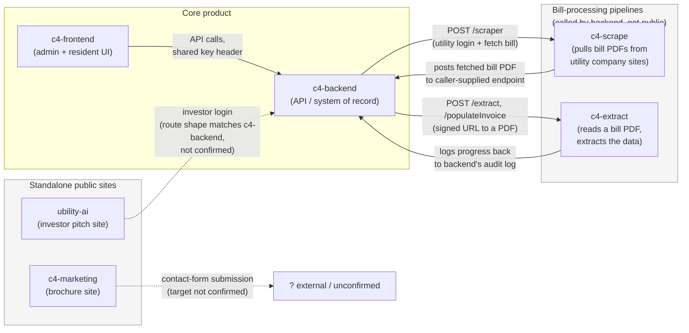
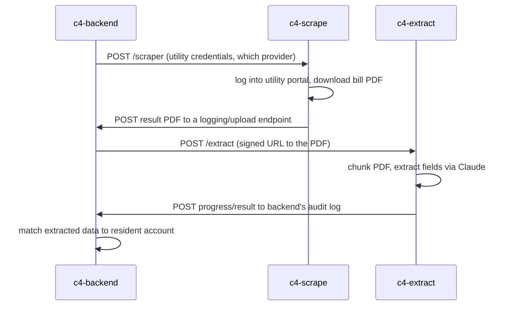

# Ubility: My Understanding and Questions for Mike

Hi Mike, thanks again for walking me through the setup. I've spent time in the six repositories and put
together a picture of how the system fits together. I've written that understanding out below, along with
diagrams, so you can confirm or correct it rather than me carrying assumptions forward. After that are the
questions where the code alone didn't tell me the answer.

This is a map of what talks to what, not a review of code quality or security. No rush on any single
question, partial answers are fine, and "I'm not sure" or "that was outside my area" is a perfectly good
answer for anything.

---

## The six repositories, as I understand them

| Repo | What I think it does | Stack I'm seeing |
|---|---|---|
| `c4-backend` | The core API and system of record: billing, invoicing, provider integrations | .NET Framework 4.7.2, ASP.NET MVC 5 + Web API 5, SignalR, EF6, SQL Server on AWS RDS |
| `c4-frontend` | The main product UI: admin back-office plus the resident portal | Next.js 14, TypeScript, MUI, Redux Toolkit |
| `c4-scrape` | Logs into utility company websites and downloads bill PDFs | Node/TS, Express, Puppeteer (headless Chromium), Cloud Run |
| `c4-extract` | Reads a bill PDF and pulls the structured data out of it | Node/TS, Express, Claude (Anthropic), Cloud Run |
| `c4-marketing` | The public marketing/brochure site | Next.js 14, MUI |
| `ubility-ai` | The investor-facing pitch site (two branded copies of one deck) | Vite, React, TypeScript |

My read is that four of these (`c4-backend`, `c4-frontend`, `c4-scrape`, `c4-extract`) form one connected
system, the actual product, and the other two (`c4-marketing`, `ubility-ai`) are standalone public
websites with no real tie back into it. Correct me if that's wrong.

---

## How I think it fits together

Solid arrows are connections I found concretely in the code (a specific endpoint or config value). Dotted
arrows are things I can see being called from one side but couldn't confirm land where I think on the
other. The dotted ones are really what my questions below are about.

---

## The bill-processing flow, as I've reconstructed it

This is my best guess at how a bill actually moves through the system, based on what each service calls and
receives. I'm inferring the trigger and a couple of the hand-offs from the receiving side, so this is the
part I'd most like you to confirm is actually the sequence.

---

## Questions where the code didn't tell me the answer

### How the pieces connect

1. **What actually triggers a bill scrape?** I can see `c4-backend` calling `c4-scrape`, but I can't tell
   whether that's on a schedule, on-demand when a resident's bill is due, or kicked off from somewhere else
   (a queue, a timer job). What sets it off?
2. **Does anything besides `c4-backend` call `c4-extract`?** Or is the backend the only caller of the PDF
   extraction service?
3. **Where does the marketing site's contact form actually go?** A CRM, an email inbox, a Ubility endpoint,
   something else?
4. **Does the investor site (`ubility-ai`) log in against `c4-backend`?** The route shape looks like the
   same ASP.NET API, but I haven't confirmed the two are pointed at each other in production.
5. **Are there other consumers of the backend API** I wouldn't see from these six repositories? A mobile
   app, a partner integration, a reporting tool, anything else that talks to it.

### Deployment and environments

6. **How does the backend get deployed to the Windows VM?** Manual publish, a script, any CI/CD, or was it
   whatever the previous engineer did by hand?
7. **Is there a staging or test environment, or is production the only one?**
8. **How is the frontend deployed,** and where is it hosted?

### The database and stored procedures

9. **Are the SQL stored procedures kept in source control anywhere,** or do they only exist in the live RDS
   database? I don't see them versioned in the repos.
10. **How do database changes get made today?** Directly against the database, through migration scripts,
    or some other process?
11. **Are there regular backups of the SQL Server database,** and has a restore ever been tested?

### Operations

12. **Are there scheduled or background jobs** running anywhere (Windows Task Scheduler, cron, a service)
    that aren't obvious from the repositories?
13. **Is there any monitoring, logging, or alerting in place** that tells you when something breaks in
    production, or is it mostly found when someone reports it?
14. **Who holds the AWS account and the domain/DNS access?** Just making sure access is available when it's
    needed.
15. **Who owns the credentials for the third-party integrations** (Yardi, RealPage, Entrata, RentManager,
    Bill.com, Forte, QuickBooks, Stripe)? Are those Ubility's own accounts, or set up under someone else?

### Scale and usage

16. **Roughly how much is the system handling today?** Number of properties or residents, and roughly how
    many bills processed a month. Ballpark is fine. This helps me size what "scaling" actually needs to
    mean.

### Documentation

17. **Is there any existing documentation, runbook, or notes** from the previous engineer, even informal?
    Anything at all is useful.

---

Whatever you can fill in helps. Happy to hop on a call instead if that's easier than writing it out.
